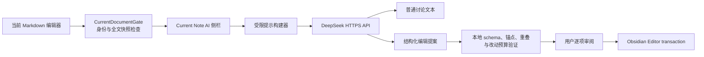

# Current Note AI

Current Note AI 是一个桌面端 Obsidian 插件，用 DeepSeek 分析、讨论并安全修改当前 Markdown 笔记。

当前公开版本：**v0.1.3**。最低 Obsidian 版本为 **1.13.0**，仅支持桌面端。

它的核心原则不是“让模型直接编辑文件”，而是把 AI 修改变成可审阅的本地事务：模型只返回结构化提案；插件在本地验证、展示差异，并且只在用户点击 **Apply selected** 后写入。

## 当前能力

- Ribbon 按钮和命令面板打开右侧聊天栏。
- iMessage 风格的用户/AI 对话气泡。
- 输入框支持 Enter、Command+Enter 或 Ctrl+Enter 发送，Shift+Enter 换行，并避免中文输入法组词确认时误发。
- 侧栏顶部可直接选择 DeepSeek 模型，并可在不发送笔记内容的前提下刷新 `/models` 列表。
- 侧栏顶部的 **History** 按钮按最近更新时间列出会话；首条用户消息会在本地自动生成会话标题。
- 只读取主编辑区当前绑定的 Markdown 源码，包括未保存内容和 frontmatter。
- 不展开 Wiki 链接、嵌入、附件、Dataview 结果或其他笔记。
- 普通 **Send** 只讨论，永远不写文件。
- **Propose changes** 请求 DeepSeek 返回版本化 JSON 编辑提案。
- 本地拒绝缺失、重复、重叠、过大、截断或格式错误的提案。
- 逐项查看和勾选修改；Apply 前再次核对 leaf、文件身份、路径和全文快照。
- 只在文档仍等于 AI 修改后的版本时允许 **Revert AI edit**。
- 最近 50 个会话保存在插件本地数据中；编辑提案和回滚副本仍只保存在内存中。

## 安装

### 从 Release 安装（推荐）

1. 从 GitHub Releases 下载 `current-note-ai-0.1.3.zip`。
2. 解压到 Vault 的 `.obsidian/plugins/current-note-ai/`。
3. 确认目录中包含 `main.js`、`manifest.json`、`styles.css`。
4. 在 **Settings → Third-party plugins** 中启用 **Current Note AI**。

### 从源码构建

1. 在本目录运行 `pnpm install` 和 `pnpm build`。
2. 在 Vault 的 `.obsidian/plugins/current-note-ai/` 中放入：
   - `main.js`
   - `manifest.json`
   - `styles.css`
3. 在 Obsidian 的社区插件设置中启用 **Current Note AI**。

## 配置 DeepSeek

1. 打开 **Settings → Current Note AI**。
2. 在 **API key** 中通过 Obsidian SecretStorage 选择或创建 secret。
3. 点击 **Test connection**，确认 `/models` 能返回当前可用模型并缓存到本地设置。
4. 在设置页输入模型名，或在侧栏顶部的 **DeepSeek** 下拉框中选择模型；刷新按钮只查询模型列表，不发送笔记内容。
5. 默认模型为 `deepseek-v4-flash`，但模型名应以测试返回结果为准。

普通 `data.json` 保存 secret 的名称引用、非敏感偏好和本地会话历史，不保存 API key 本身。会话历史包含用户消息和 DeepSeek 回复，因此应按笔记内容同等保护该文件。

## 数据边界

打开侧栏不会发送任何数据。首次 Send 或 Propose changes 前，插件会明确询问是否允许把以下内容发送给 DeepSeek：

- 当前绑定笔记的完整 Markdown 文本；
- 当前内存会话中最近的用户和助手消息。

默认不会发送 Vault 名、文件路径、其他文件内容或遥测。DeepSeek 已经收到请求后，本地 Cancel 只能忽略迟到响应，不能撤销远端处理。

历史会话与创建它的笔记路径绑定。若加载历史时当前绑定的是另一篇笔记，插件只允许查看旧消息，并锁定发送按钮；回到原笔记并重新绑定后才能继续。打开历史列表或加载历史本身不会产生网络请求。

## 架构概览



插件不会向模型暴露命令、文件系统、Vault 搜索或任意工具。讨论请求只能读取当前绑定笔记的完整 Markdown 快照；编辑请求只能返回受限 JSON，真正的文本替换在本地完成。

主要模块：

- `src/context.ts`：绑定当前 Markdown leaf，并在读取和写入前核对 leaf、文件对象与路径。
- `src/provider/deepseek.ts`：封装 `/models` 与 `/chat/completions` 请求和错误映射。
- `src/core/prompt.ts`：构建讨论与编辑提示，明确把笔记视为不可信数据。
- `src/core/edit-proposal.ts`：解析和验证编辑提案，拒绝重复、缺失、重叠或过大的修改。
- `src/core/conversation-history.ts`：本地命名、清洗、排序并限制历史会话。
- `src/view.ts`：侧栏、消息气泡、History、模型选择、差异审阅和 Apply/Revert 交互。

## 编辑安全协议

DeepSeek 只能返回以下形状的 JSON：

```json
{
  "schemaVersion": 1,
  "summary": "修改摘要",
  "operations": [
    {
      "id": "edit-1",
      "oldText": "必须在快照中唯一出现的原文",
      "newText": "替换文本",
      "reason": "修改理由"
    }
  ]
}
```

插件不接受模型提供的文件路径、offset、命令或工具调用。Apply 瞬间只要笔记发生过任何变化，旧提案就会失效，不会自动重基或模糊匹配。

## MVP 限制

- 仅桌面端和 Markdown 标签页。
- 使用 Obsidian `requestUrl` 的完整响应模式，暂不逐 token 流式显示。
- 不支持 PDF、Canvas、EPUB、多文件编辑、全库检索、历史导出或跨设备会话合并。
- 单次笔记正文上限为 1,500,000 字符；超限时拒绝发送，不会静默截断。
- 最多保留最近 50 个会话，每个会话最多持久化最近 200 条用户/助手消息。
- 精确锚点若在正文中重复，会拒绝该提案并要求重新生成更长的上下文锚点。

## 开发

```bash
pnpm install
pnpm check
pnpm build
```

`pnpm check` 会运行 TypeScript 类型检查和纯函数测试。涉及多窗格、重命名、同步并发、Editor Undo 或 DeepSeek 长连接的改动，还应在真实 Obsidian 中进行集成验证。

## 开源与安全

本项目采用 [MIT License](LICENSE)。安全设计、密钥存储与漏洞报告建议见 [SECURITY.md](SECURITY.md)，版本变化见 [CHANGELOG.md](CHANGELOG.md)，架构和威胁边界详见 [docs/ARCHITECTURE.md](docs/ARCHITECTURE.md)。
