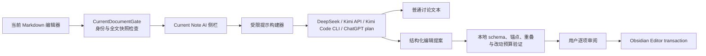

# Current Note AI

Current Note AI 是一个桌面端 Obsidian 插件，用 DeepSeek API、Kimi API、本地 Kimi Code 会员来源或官方 ChatGPT 订阅接入分析、讨论并安全修改当前 Markdown 笔记。

当前版本：**v0.1.14**。最低 Obsidian 版本为 **1.13.0**，仅支持桌面端。

它的核心原则不是“让模型直接编辑文件”，而是把 AI 修改变成可审阅的本地事务：模型只返回结构化提案；插件在本地验证、展示差异，并且只在用户点击 **Apply selected** 后写入。

## 当前能力

- Ribbon 按钮和命令面板打开右侧聊天栏。
- iMessage 风格的用户/AI 对话气泡。
- 用户消息和 AI 回复均可拖选、用系统快捷键复制；每条消息的 **Copy** 按钮复制原始 Markdown/LaTeX，不改变历史中保存的正文。
- 每条 AI 回复气泡外顶部显示当次生成的 **Model / Reasoning**，底部显示本地日期时间（精确到秒），悬停查看时区与 ISO 时间。Discussion、Continue、Edit 和 Edit retry 都在请求发出前固定记录模型和 Reasoning 设置，不会随之后的模型/设置切换改变。
- **Reasoning** 显示请求强度；Auto 表示交由服务器默认选择，不推断其实际强度。当前 DeepSeek/Kimi API/Kimi Code 请求均关闭 thinking，记录为 Off。旧历史未记录的 Reasoning 显示 Not recorded；Apply/Revert 通知标为 Local action，不冒充 AI 回答。
- 消息支持安全的 Markdown 排版，包括加粗、斜体、标题、列表、表格、引用、链接和代码块。离线 KaTeX 支持 `$…$`、`$$…$$`、`\(…\)`、`\[…\]` 公式，样式和字体随插件内置；代码中的公式保留为代码，非法公式可读降级。原始 HTML 与自动嵌入仍被禁用。
- 设置页可创建 DeepSeek/Kimi API 或 Kimi Code 本地档案；API 档案有独立的 SecretStorage 引用，各档案分别保存模型目录、启用状态与隐私同意。
- 每条 Kimi 档案可明确选择中国区 (`api.moonshot.cn`) 或国际区 (`api.moonshot.ai`)；插件不会把同一密钥静默重试到另一区域。
- 第三种来源 **Kimi Code · Local quota** 复用本机官方 CLI 的会员 OAuth 登录，不需要填写 API key；模型固定为 **K3-256k**，可在侧栏顶部现有模型菜单直接选择。
- 第四种来源 **ChatGPT · Plan quota** 使用官方 Sign in with ChatGPT 订阅授权，不需要 API key 或 Codex CLI；GPT 模型从该账户动态获取，顶部可手动选择推理强度和 Standard/Fast 速度。
- 所有已启用档案的模型仍在同一个分组下拉框中显示，不增加单独的供应商按钮；Kimi API 只接受经该账户 `/models` 验证的 `kimi-k2.6`，Kimi Code 固定使用 `k3-256k`。
- Discussion、Edit、Continue 与 Edit retry 都绑定到明确的 profile/model；档案被删除、禁用或更改后会阻断旧请求，不会静默改用另一个账户。
- DeepSeek 请求显式使用 non-thinking 模式，温度设置仅适用于 DeepSeek；Kimi 请求非流式、禁用 thinking，并设置 120 秒本地超时。
- 回答达到输出上限时会单独标记为未完成，并提供最多两次、由用户触发的 **Continue**；警告状态不会写入模型正文。
- 输入框严格使用 Enter 换行、Shift+Enter 发送，并避免中文输入法组词确认时误发。
- 侧栏顶部可直接选择四个来源的模型；刷新按钮仅查询账户模型或检查本机 CLI 配置，不发送笔记内容。
- 侧栏顶部的 **History** 按钮按最近更新时间列出会话；首条用户消息会在本地自动生成会话标题。
- 只读取主编辑区当前绑定的 Markdown 源码，包括未保存内容和 frontmatter。
- 不展开 Wiki 链接、嵌入、附件、Dataview 结果或其他笔记。
- 普通 **Send** 只讨论，永远不写文件。
- **Propose changes** 请求所选供应商返回版本化 JSON 编辑提案。
- 本地拒绝缺失、重复、重叠、过大、截断、格式错误或声明 `needs_segmentation` 的提案。
- 不完整编辑可由用户发起一次更高 token 预算的完整重试；半截 JSON 永远不会续接或局部应用。
- 逐项查看和勾选修改；Apply 前再次核对 leaf、文件身份、路径和全文快照。
- 只在文档仍等于 AI 修改后的版本时允许 **Revert AI edit**。
- 最近 50 个会话保存在插件本地数据中；单会话最多 5 MiB、全部历史最多 20 MiB，编辑提案和回滚副本仍只保存在内存中。
- Apply/Revert 成功与历史保存失败会分别提示；保存使用 revision 串行化，并在待保存时提供显式 **Retry save**。编辑器变化只刷新 stale/revert 状态，不会全量重绘聊天内容；Markdown HTML 解析结果按消息缓存，滚动位置得以保持。

## 安装

### 从 Release 安装（推荐）

1. 从与 `manifest.json` 版本号一致的 GitHub Release 下载 `current-note-ai-x.y.z.zip`。
2. 解压到 Vault 的 `.obsidian/plugins/current-note-ai/`。
3. 确认目录中包含 `main.js`、`manifest.json`、`styles.css`。
4. 在 **Settings → Third-party plugins** 中启用 **Current Note AI**。

### 从源码构建

1. 在本目录运行 `pnpm install` 和 `pnpm build`。
2. 在 Vault 的 `.obsidian/plugins/current-note-ai/` 中放入：
   - `main.js`
   - `manifest.json`
   - `styles.css`
3. 在 Obsidian 的社区插件设置中启用 **Current Note AI**。

## 配置 DeepSeek 与 Kimi

1. 打开 **Settings → Current Note AI**。
2. 点击 **Add DeepSeek** 或 **Add Kimi** 创建账户档案；同一供应商可以添加多次并分别命名。
3. Kimi 档案先在 **API region** 中选择创建密钥时使用的中国区或国际区；随后在 **API key secret** 中选择或创建 SecretStorage secret，并点击 **Test connection** 缓存该账户的模型。
4. 在侧栏唯一的模型下拉框中按“档案 · 供应商”选择模型；刷新按钮只查询已启用档案的模型列表，不发送笔记内容。
5. 档案可排序、禁用或删除。更换密钥或 Kimi API 区域会清除该档案的模型缓存、当前选择和隐私授权，必须重新测试与选择。

普通 Discussion 与 Edit 请求都显式关闭 DeepSeek thinking；Kimi 请求固定非流式并禁用 thinking。温度设置仅作用于 DeepSeek。设置中的 **Maximum output tokens** 是单次请求预算；Discussion 的 Continue 会产生新的计费请求，Edit 的更高预算重试也会产生新的计费请求。

普通 `data.json` 保存 secret 的名称引用、非敏感档案信息和本地会话历史，不保存 API key 本身。升级前会一次性保留 `data.v0.1.6.rollback.json`；它同样只含旧设置与 secret 引用。会话消息保存冻结的 profile/provider/model 来源，因此应按笔记内容同等保护这些文件。

## 配置 Kimi Code 本地会员额度

1. 本机安装官方 **Kimi Code CLI 0.36.1 或更新版本**，并通过 CLI 登录 **Kimi Code membership / OAuth**。平台 API key 登录不属于这个来源。
2. 本次升级会在保留原模型选择的同时，一次性新增 **Kimi Code · Local quota** 档案；删除后不会在下一次启动恢复，也可通过 **Add Kimi Code · Local quota** 重新添加。
3. 插件优先发现 `~/.kimi-code/bin/kimi`，也检查常见安装位置与 PATH。发现失败时，在设置的 **Kimi Code executable** 填写官方可执行文件的绝对路径；不接受整条命令或 Windows `.cmd/.bat` 包装器。npm 安装需要 Obsidian 子进程的 PATH 能找到 Node.js。
4. 点击 **Check local CLI** 验证 CLI 版本和本地会员模型配置。这一步不发送笔记、不消耗推理额度，也不保证云端登录尚未过期或额度足够；首次真实请求由 CLI 验证。
5. 在侧栏顶部模型菜单选择 **Kimi Code · Local quota → k3-256k**。插件始终显式传入 `kimi-code/k3-256k`，不会改用未指定版本的 K3、Kimi API 或其他账户。
6. 首次 Send / Propose changes 时同意该来源的数据披露。Discussion、History、Continue、编辑提案预览、Apply/Revert 使用原有流程；真正写笔记仍需要用户确认。

这是“本机 CLI 登录 + 云端模型”，不是离线 AI。请求使用 CLI 的会员额度，无须在插件填写 API key。插件不提取或持久化 OAuth token，也不伪造官方客户端身份。支持的账户套餐、剩余额度与限制由 Kimi Code 决定，额度不足或未获 K3-256k 权限时不会转为 API 付费请求。官方说明：[CLI 登录与会员来源](https://www.kimi.com/code/docs/en/kimi-code-cli/guides/getting-started)、[K3-256k 模型配置](https://www.kimi.com/code/docs/en/kimi-code/models.html)。

每次调用创建独立临时目录，专用 agent 禁用所有工具和子代理，不继承默认编码助手提示。笔记与历史作为 JSON 数据写入权限受限的临时文件，不放进进程参数，也不会展开 CLI 的 `${cwd}`、`${agents_md}`、`${base_prompt}` 等模板变量。该文件与临时目录会在结束后删除；**CLI 自己的会话日志仍会保存传入的笔记与对话**，删除插件 History 不会删除 CLI 历史。CLI 安装和配置属于本机可信执行环境，不是操作系统沙箱；本插件对启用的全局 hooks、plugins、MCP 采取阻断策略，且不会替用户改动这些配置。

输出预算通过 CLI 的 `KIMI_MODEL_MAX_COMPLETION_TOKENS` 传递，并请求关闭 thinking；最终是否支持关闭取决于所用模型/CLI。插件不显示或持久化 CLI 原始 reasoning/stderr，只从本次新会话记录读取完成原因与数值用量。若诊断格式不兼容、缺失完成原因或输出截断，编辑提案不会变成可应用修改。客户端未来升级可能需要适配，本机已实测版本为 0.36.1。

## 配置 ChatGPT Plus 订阅额度（第四来源）

采用 OpenAI 官方为开源、本地应用提供的 **Sign in with ChatGPT / ChatGPT plan usage**，不是把 Plus 当作平台 API key，也不使用 ChatGPT 网页自动化、私有 backend-api 或 Codex 凭据。模型仍由云端处理；关闭 ChatGPT/Codex 客户端不影响该来源，但 Obsidian 必须运行并联网。

1. 升级后一次性新增 **ChatGPT · Plan quota** 档案，保留现有模型选择；也可在设置手动添加多个档案，分别授权不同账户或工作区。
2. 在 **Settings → Current Note AI → ChatGPT · Plan quota** 点击 **Continue with ChatGPT**。插件只准备登录链接；自行点击链接或复制到浏览器，不会自动打开或切换浏览器。
3. 在 OpenAI 页面登录并授权此应用使用订阅额度；回调只监听本机 `127.0.0.1` 的临时端口。五分钟未完成或关闭登录弹窗会取消。身份与权限验证成功后，插件刷新该账户的模型目录。
4. 在侧栏顶部选择该档案的 **GPT 模型**，并手动选择 **Reasoning** 和 **Speed**。推理默认 **Auto**（不强行覆盖模型默认）；优先展示模型目录声明的档位，否则展示保守候选。具体可用性由模型/服务校验，不支持时明确报错，不自动换档。
   - 按用户要求，若已授权账户的目录遗漏 **GPT-6.1 Sol**，插件会补充 `gpt-6.1-sol`，并标注 **manual · access unverified**。这是手动调用选项，不是账号权限证明；Send 时由服务端判断，失败不会切换其他模型。该模型支持 low/medium/high/xhigh/max，不支持 none/minimal。账户目录开始列出它后，刷新会自动移除手动标记。
5. 速度可选 **Standard / Fast**。Fast 通常消耗更多订阅额度，是否允许取决于账户、模型与接入政策；服务拒绝时不会偷偷按 Standard 重试。服务若返回实际速度档位，会显示在回答来源信息中。**Ultrafast 在 Plus 下不可选**。
6. 首次发送笔记仍需同意数据披露。侧栏显示 **Using ChatGPT plan** 与 **Manage usage**；可在 [ChatGPT Usage](https://chatgpt.com/settings/usage) 查看、限制或撤销应用权限。设置中的 **Sign out** 会清除本机 token，并尝试撤销可续期会话；若远端撤销未确认，会明确提示。

注意以下边界：

- 订阅额度与其他使用 ChatGPT plan 的应用共享，不是新增独立或无限额度。若你允许此应用使用额外 credits，超出套餐后可能消耗这些 credits；插件不会购买额度或回退到平台 API key。
- 官方接入仍属预览，账户、地区、工作区政策与 rollout 可能限制使用；没有真实授权前，不能保证你的账户一定获准。测试使用模拟 OAuth/JWKS 与 Responses 事件，不冒充真实账户端到端验证。
- 该预览不支持硬性 `max_output_tokens`，所以 **Maximum output tokens** 对 ChatGPT 是提示词长度目标，不能保证硬截断。只在明确收到 `response.completed` 且状态为 `completed` 时认定完整；未知、截断或中断的编辑绝不应用。
- 当前用保守的 **32k token** 上下文预算，超出会拒绝而不截断；不读取账户已有 ChatGPT 对话，也不提供文件、命令或浏览器工具。
- 传输层兼容缺失或错误的 `Content-Type`：按正文的 SSE 帧格式确认事件流，但仍要求明确的完成事件。JSON/HTML 不会被当作完整回答；JSON 错误会显示安全的账户/额度提示。
- OAuth token 与注册记录保存在机器本地 `~/.config/current-note-ai/chatgpt/`，Unix 目录权限为 `0700`、文件为 `0600`，不是系统钥匙串加密。`data.json` 只保存随机账户标识和非敏感选项；不要手动同步/提交凭据目录。应用退出、History 删除或档案删除不会自动撤销远端授权，应先 Sign out 或在 ChatGPT Settings 中断开。
- 同一会话的刷新在进程内串行，且用本机目录锁防止多实例争抢 rotating refresh token；进程异常退出可能留下 `.json.lock` 目录，仅在确认没有实例使用该账户时手动移除对应锁。

官方文档：[开源应用订阅接入](https://developers.openai.com/siwc/token-sharing-open-source)、[登录与授权](https://developers.openai.com/siwc/token-sharing-open-source/sign-in)、[模型与推理](https://developers.openai.com/siwc/token-sharing-open-source/models-and-inference)、[预览限制](https://developers.openai.com/siwc/token-sharing-open-source/preview-limitations)、[共享额度与会话](https://developers.openai.com/siwc/token-sharing-open-source/profiles-and-sessions)、[速度权限与额度](https://learn.chatgpt.com/docs/agent-configuration/speed)。

## 数据边界

打开侧栏不会发送任何数据。首次向某供应商 Send 或 Propose changes 前，插件会明确询问是否允许把以下内容发送给该供应商；跨供应商使用已有历史时会再次披露并征求对应供应商同意：

- 当前绑定笔记的完整 Markdown 文本；
- 当前内存会话中最近的用户和助手消息。

默认不会发送 Vault 名、文件路径、其他文件内容或遥测。DeepSeek/Kimi API 的 Cancel 只忽略迟到响应；Kimi Code 的 Cancel 会终止本地 CLI，ChatGPT 的 Cancel 会关闭本地 HTTPS 连接。都不能撤销供应商已经开始的处理或计费/额度消耗。

请求体会按所选模型目录中的上下文窗口做保守启发式预算（DeepSeek 缺省回退为 64,000 token，Kimi K2.6 上限为 256,000 token，Kimi Code K3-256k 为 262,144 token，ChatGPT 暂采用 32,000 token）；会员/订阅来源另检查 JSON 编码后的实际提示预算。超过预算会在联网前阻断，不会静默截断。两个 API 适配器有 120 秒本地超时；Kimi Code 和 ChatGPT 在 180 秒超时后停止本地进程或连接，已提交的云端请求可能仍在处理或消耗额度。插件不会自动重试，但官方 CLI 可能执行自己的内部重试策略。

历史会话与创建它的笔记路径绑定。若加载历史时当前绑定的是另一篇笔记，插件只允许查看旧消息，并锁定发送按钮；回到原笔记并重新绑定后才能继续。打开历史列表或加载历史本身不会产生网络请求。

## 架构概览


```mermaid
flowchart LR
  Editor["当前 Markdown 编辑器"] --> Gate["CurrentDocumentGate\n身份与全文快照检查"]
  Gate --> Sidebar["Current Note AI 侧栏"]
  Sidebar --> Prompt["受限提示构建器"]
  Prompt --> Providers["DeepSeek / Kimi API / Kimi Code CLI / ChatGPT plan"]
  Providers --> Discussion["普通讨论文本"]
  Providers --> Proposal["结构化编辑提案"]
  Proposal --> Validator["本地 schema、锚点、重叠与改动预算验证"]
  Validator --> Review["用户逐项审阅"]
  Review --> Transaction["Obsidian Editor transaction"]
```

插件不会向模型暴露命令、文件系统、Vault 搜索或任意工具。讨论请求只能读取当前绑定笔记的完整 Markdown 快照；编辑请求只能返回受限 JSON，真正的文本替换在本地完成。

主要模块：

- `src/context.ts`：绑定当前 Markdown leaf，并在读取和写入前核对 leaf、文件对象与路径。
- `src/provider/deepseek.ts`、`src/provider/kimi.ts`：分别封装供应商 `/models` 与 `/chat/completions` 请求和错误映射。
- `src/provider/kimi-code.ts`：本地 CLI 发现、会员配置核验、隔离 agent、无 shell 子进程、取消/超时和本次会话完成状态解析。
- `src/provider/chatgpt-auth.ts`、`chatgpt-http.ts`、`chatgpt.ts`：官方订阅 OAuth、机器本地凭据、可取消 HTTPS、账户模型目录和 SSE 完成状态验证。
- `src/provider/registry.ts`、`src/core/provider-profiles.ts`：维护代码内置的供应商/区域端点预设、账户档案身份和冻结请求目标；设置数据不能注入任意 URL。
- `src/core/prompt.ts`：构建讨论与编辑提示，明确把笔记视为不可信数据。
- `src/core/edit-proposal.ts`：解析和验证编辑提案，拒绝重复、缺失、重叠或过大的修改。
- `src/core/conversation-history.ts`：本地命名、清洗、排序并限制历史会话。
- `src/view.ts`：侧栏、消息气泡、History、模型选择、差异审阅和 Apply/Revert 交互。

## 编辑安全协议

所选供应商的完整编辑响应只能使用以下形状的 JSON：

```json
{
  "schemaVersion": 2,
  "status": "complete",
  "summary": "修改摘要",
  "coveredTargets": ["已覆盖的修改目标"],
  "uncoveredTargets": [],
  "operations": [
    {
      "id": "edit-1",
      "oldText": "必须在快照中唯一出现的原文",
      "newText": "替换文本",
      "reason": "修改理由"
    }
  ]
}
```

如果完整提案无法安全放进一次响应，模型必须返回 `status: "needs_segmentation"`、空 `operations` 和明确的 `uncoveredTargets`。插件不会把这种响应或任何截断 JSON 创建成可应用提案。

插件不接受模型提供的文件路径、offset、命令或工具调用。Apply 瞬间只要笔记发生过任何变化，旧提案就会失效，不会自动重基或模糊匹配。

## MVP 限制

- 仅桌面端和 Markdown 标签页。
- DeepSeek/Kimi 使用 Obsidian `requestUrl`；ChatGPT 在内部读取 SSE，但目前侧栏仍在完成后显示回答，而不是逐 token 更新。
- GPT 推理强度可手动选择；DeepSeek/Kimi API 仍显式禁用 thinking，Kimi Code 请求关闭，但服从 CLI/模型支持。
- 不支持 PDF、Canvas、EPUB、多文件编辑、全库检索、历史导出或跨设备会话合并。
- 单次笔记正文上限为 1,500,000 字符；超限时拒绝发送，不会静默截断。
- 最多保留最近 50 个会话，每个会话最多持久化最近 200 条用户/助手消息。
- 单会话历史最多 5 MiB、全部历史最多 20 MiB；支持删除单条会话或全部历史，笔记重命名会更新绑定与历史路径。
- 请求体按所选模型的上下文窗口使用保守启发式预算，超限在联网前拒绝；API 的 120 秒和本地 CLI 的 180 秒 timeout 都不代表远端取消。
- 精确锚点若在正文中重复，会拒绝该提案并要求重新生成更长的上下文锚点。

## 开发

```bash
pnpm install
pnpm check
pnpm build
```

`pnpm check` 会运行 TypeScript 类型检查和纯函数测试；CI 还会构建 Release 三件套及 zip。涉及多窗格、重命名、同步并发、Editor Undo 或供应商网络请求的改动，仍应在真实 Obsidian 中进行集成验证；仓库测试不等同于真实 Obsidian 验证。

## 开源与安全

本项目采用 [MIT License](LICENSE)。安全设计、密钥存储与漏洞报告建议见 [SECURITY.md](SECURITY.md)，版本变化见 [CHANGELOG.md](CHANGELOG.md)，架构和威胁边界详见 [docs/ARCHITECTURE.md](docs/ARCHITECTURE.md)。
